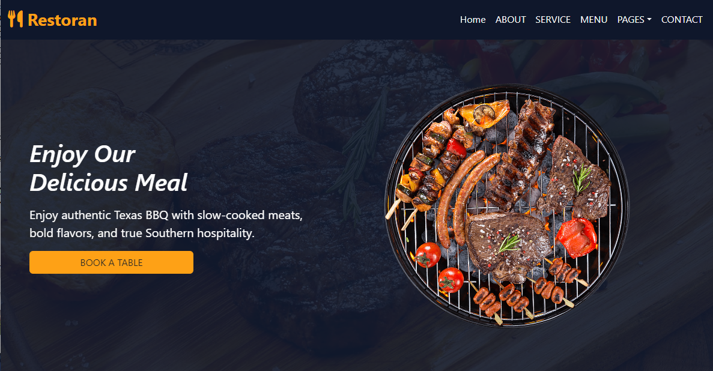
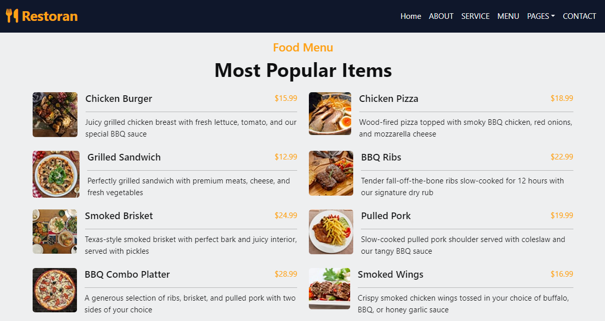
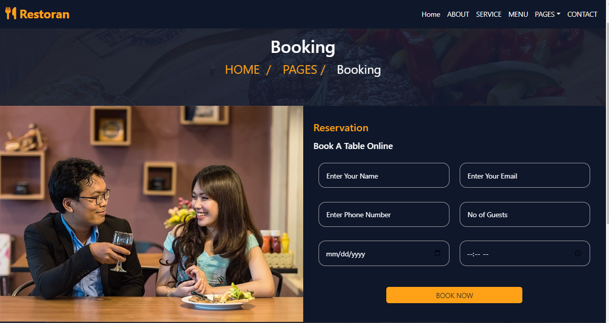

# 🍖 Restoran - BBQ Restaurant Web App

A fully responsive and animated restaurant website for a Texas-style BBQ place. Built using modern web technologies to deliver a clean, interactive, and visually appealing user experience.

🔗 [Live Demo](https://alaaatef2003.github.io/Restaurant_Web_app1/) • 💻 [GitHub Repository](https://github.com/AlaaAtef2003/Restaurant_Web_app1.git)

---

## ✨ Highlights

- 🔥 Visually stunning hero section with smooth animations
- 📱 Mobile-first and fully responsive design
- 📋 Interactive online reservation form with confirmation
- 🍽️ Structured food menu with item images and prices
- 👨‍🍳 Chef profiles with hover effects
- 💬 Carousel for customer testimonials
- 📞 Contact section with social media links

---

## 🖼️ Preview

### 💡 Home Section


### 🍔 Menu Section


### 📅 Booking Section


---

## 🚀 Technologies Used

| Technology   | Description                                 |
|--------------|---------------------------------------------|
| **HTML5**    | Page structure and semantic layout          |
| **CSS3**     | Styling, layout design, and animations      |
| **Bootstrap 5** | Responsive grid system & UI components |
| **JavaScript** | DOM manipulation and interactivity       |
| **Font Awesome** | Icon library for rich visuals         |
| **Animate.css**  | CSS-based entrance animations         |
| **Google Fonts** | Web typography for clean UI            |

---

## 📂 How to Run the Project Locally

You can run the project on your local machine easily without needing any frameworks or build tools:

```bash
# 1. Clone the repository
git clone https://github.com/AlaaAtef2003/Restaurant_Web_app1.git

# 2. Navigate to the project directory
cd Restaurant_Web_app1

# 3. Open the website in your browser
Open the file named index.html in your preferred browser.
